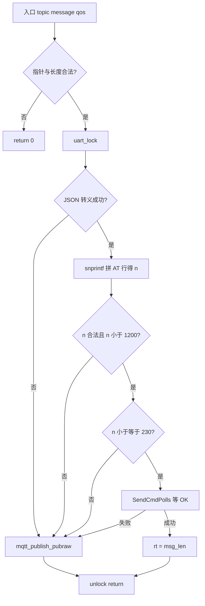

# ESP8266 MQTT 属性上报与 `mqtt_publish_data` 说明

> **适合谁读**：已能云端控灯，想搞懂 **周期上报**（温湿度、LED 状态等）在代码里怎么发到 `property/post`。  
> **对应源码**：`esp8266_mqtt.c` 中 `mqtt_publish_data()`、`mqtt_report_devices_status()`；宏在 `esp8266_mqtt.h`。  
> **与下行控灯的区别**：控灯应答走 `mqtt_publish_set_reply()`，见 [OneNET云端下行控灯与set_reply应答说明.md](./OneNET云端下行控灯与set_reply应答说明.md)。

---

## 1. 一分钟看懂：数据从哪来到哪去

```text
app_task_mqtt（每秒）
    → mqtt_report_devices_status()
        → sprintf 写入 g_mqtt_msg（JSON）
        → mqtt_publish_data(MQTT_PUBLISH_TOPIC, g_mqtt_msg, 1)
            → 转义 JSON → 拼 AT+MQTTPUB 或走 AT+MQTTPUBRAW
            → USART3 发给 ESP8266
    → 模块 MQTT 发到云端 …/thing/property/post
    → 平台可能回 …/property/post/reply（调试可见）
```

| 名称 | 含义 |
|------|------|
| `MQTT_PUBLISH_TOPIC` | 上报主题宏，展开为 `$sys/<产品ID>/<设备名>/thing/property/post` |
| `g_mqtt_msg` | 本次要上报的 JSON 正文（最长 526 字节） |
| `mqtt_publish_data` | **通用发布函数**，把 `topic` + `message` 通过 AT 发出去 |

---

## 2. `topic` 是怎么来的？

**不是在 `mqtt_publish_data` 内部计算的**，而是 **调用者当参数传入**。

本工程唯一调用处：

```c
mqtt_publish_data(MQTT_PUBLISH_TOPIC, g_mqtt_msg, 1);
```

`MQTT_PUBLISH_TOPIC` 在 `esp8266_mqtt.h` 中定义：

```c
#define MQTT_PUBLISH_TOPIC "$sys/" MQTT_PRODUCT_ID "/" MQTT_DEVICE_NAME "/thing/property/post"
```

即：**编译期写死的 OneNET 物模型「属性上报」主题**，与你在控制台看到的上报路径一致。改产品/设备名时只改头文件宏即可。

---

## 3. 两个长度常量：1200 和 230（单位都是字节）

| 符号 | 数值 | 单位 | 含义 |
|------|------|------|------|
| `s_mqtt_pub_line[1200]` | 1200 | **字节**（`char` 个数） | MCU **本地缓冲区**，用来存放拼好的一整行 AT 字符串 |
| `ESP8266_AT_LINE_SAFE_MAX` | 230 | **字节** | **一条 AT 命令建议不超过的长度**（模块单行输入约 256 字节上限，留余量） |

关系：

```text
先用 1200 字节的数组把 AT 行拼出来 → 得到长度 n
    n 装不下（n ≥ 1200）        → 走 PUBRAW
    n ≤ 230                     → 可尝试 AT+MQTTPUB
    230 < n < 1200              → 数组能装下，但模块单行吃不下 → 走 PUBRAW
```

**记忆**：1200 = 软件「记事本」有多大；230 = 模块「一口能吃多少」。

---

## 4. `int n` 与 `snprintf`（660～662 行）

```c
n = snprintf(s_mqtt_pub_line, sizeof(s_mqtt_pub_line),
    "AT+MQTTPUB=0,\"%s\",\"%s\",%u,0\r\n",
    topic, s_mqtt_esc, (unsigned int)qos);
```

| 问题 | 答案 |
|------|------|
| `n` 是什么？ | **`snprintf` 的返回值**，不是 MQTT 字段 |
| 成功时 `n` 表示什么？ | **完整 AT 命令应有的字符个数**（不含结尾 `\0`），一般等于 `strlen(s_mqtt_pub_line)` |
| 被截断时？ | `n` 仍可能是 **≥ 1200** 的“应有长度”，用于发现缓冲区不够 |
| 出错时？ | `n < 0` |

**为何不用 `strlen` 代替？**  
若缓冲区被截断，`strlen` 只能看到已写入部分的长度；`snprintf` 的返回值能反映 **本来要多长**，便于走 PUBRAW。

---

## 5. `mqtt_publish_data` 逐句逻辑（639～683 行）

```c
uint32_t mqtt_publish_data(char *topic, char *message, uint8_t qos)
```

| 行号区段 | 代码 | 作用 |
|----------|------|------|
| 641～643 | `msg_len`, `n`, `rt` | `msg_len`=JSON 原始长度；`n`=AT 行长度；`rt`=结果，默认 0 失败 |
| 645～646 | `topic/message` 空指针 | 直接 `return 0` |
| 647～649 | `strlen(message)` | 长度为 0 或超过 `g_mqtt_msg` 容量则失败 |
| 651 | `esp8266_uart_lock()` | 与 monitor 任务互斥，避免抢 `g_esp8266_rx_buf` |
| 653～658 | `mqtt_at_escape_payload` | `"`、`\`、`,` → `\"`、`\,` 等；失败则 **PUBRAW** 发原始 `message` |
| 660～662 | `snprintf` → `s_mqtt_pub_line` | 拼 `AT+MQTTPUB=0,"topic","转义JSON",qos,0` |
| 663～668 | `n<0` 或 `n>=1200` | 拼失败或装不下 → **PUBRAW** |
| 671～677 | `n <= 230` | `ESP8266_SendCmdPolls` 发整行 AT 等 `OK`；失败再 **PUBRAW** |
| 678～679 | `n > 230` | 单行 AT 过长 → 直接 **PUBRAW** |
| 681～682 | `unlock` + `return rt` | 成功时 `rt = msg_len`（>0），失败 `rt = 0` |

### 5.1 流程图



---

## 6. 三条发布路径对比（新手对照表）

| 函数 | 主题 | 典型负载 | AT 方式 | 逗号 `\,` |
|------|------|----------|---------|-----------|
| `mqtt_publish_data` | `property/post` | 长 JSON（温湿度等） | 优先 MQTTPUB，否则 **PUBRAW** | MQTTPUB 路径需要转义 |
| `mqtt_publish_set_reply` | `property/set_reply` | 短 JSON 应答 | **仅 MQTTPUB** | 必须转义 |
| `mqtt_publish_pubraw` | 调用者传入 | 任意长度 | **MQTTPUBRAW** + 原始字节 | JSON 内逗号 **不** 参与 AT 参数解析 |

手工练 AT 见 [esp8266AT指令.md](./esp8266AT指令.md) 第 7 节。

---

## 7. 常见疑问

**Q：`mqtt_publish_data` 会用来发控灯应答吗？**  
A：不会。控灯应答用 `mqtt_publish_set_reply()`，主题固定为 `MQTT_SET_REPLY_TOPIC`。

**Q：上报成功返回值是什么？**  
A：`strlen(message)` 相同的正整数；`0` 表示失败。`mqtt_report_devices_status` 当前未检查返回值。

**Q：为什么属性 JSON 常走 PUBRAW？**  
A：转义后整行 AT 往往 **超过 230 字节**，模块单行 `AT+MQTTPUB` 吃不下。

---

## 8. 相关文档

| 文档 | 内容 |
|------|------|
| [OneNET云端下行控灯与set_reply应答说明.md](./OneNET云端下行控灯与set_reply应答说明.md) | `buf`、`property/set`、PEout 控灯、10411 与 `\,` |
| [ESP8266-OneNET-MQTT与FreeRTOS任务说明.md](./ESP8266-OneNET-MQTT与FreeRTOS任务说明.md) | 三任务、队列、上行/下行数据流简图 |
| [esp8266AT指令.md](./esp8266AT指令.md) | 串口手工发 AT、MQTTPUB / MQTTPUBRAW 示例 |

---

*文档版本：对应 `esp8266_mqtt.c` 中 `mqtt_publish_data` 与 `ESP8266_AT_LINE_SAFE_MAX`、`s_mqtt_pub_line[1200]` 实现；若修改发布逻辑请同步更新本节。*
