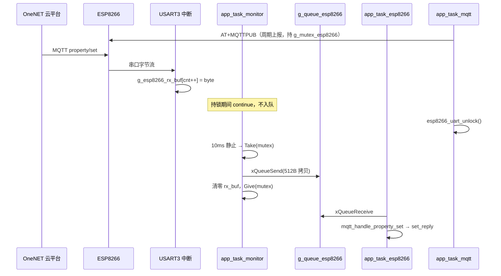

# ESP8266 连接 OneNET（MQTT）与 FreeRTOS 任务说明

本文档对应工程中 `esp8266.c` / `esp8266.h`、`esp8266_mqtt.c` / `esp8266_mqtt.h` 以及 `main.c` 内与 MQTT 相关的任务整理说明，并与源码中新补充的注释一致，便于后续维护与答辩说明。

---

## 1. 总体架构

- **通信方式**：STM32 通过 **USART3** 与 ESP8266 交互；ESP8266 固件使用 **MQTT AT 指令集**（如 `AT+MQTTUSERCFG`、`AT+MQTTCONN`、`AT+MQTTPUB` / `AT+MQTTPUBRAW` 等），在模块内部完成与云端的 MQTT 连接。
- **云平台**：`esp8266_mqtt.h` 中配置为 **OneNET 新版物模型**（域名 `mqtts.heclouds.com`、端口 `1883`，主题形如 `$sys/<产品ID>/<设备名>/thing/property/...`）。
- **MCU 职责**：组网上下文（SSID/密码）、鉴权参数、属性 JSON 上报、解析云端下发的属性设置；不负责 TCP/IP 协议栈实现。

---

## 2. 源文件分工

| 文件 | 作用 |
|------|------|
| `esp8266.h` / `esp8266.c` | USART3 初始化、字节/字符串发送、通用 AT（透传、TCP 等）及 `g_esp8266_rx_buf` 配合逻辑说明。 |
| `esp8266_mqtt.h` | OneNET 产品/设备/鉴权、发布与订阅主题宏，以及对外的 MQTT AT 封装声明。 |
| `esp8266_mqtt.c` | AT 轮询等待、MQTT 连接/订阅/发布（含 JSON 转义与 PUBRAW 长包）、`esp8266_mqtt_init` 全流程、`mqtt_report_devices_status` 组包上报。 |
| `main.c` | 三个与无线相关的 FreeRTOS 任务：`app_task_mqtt`、`app_task_esp8266`、`app_task_monitor`，以及队列 `g_queue_esp8266`、标志 `g_esp8266_init`、`g_mutex_esp8266`。 |
| `SYSTEM/usart/usart.c` | USART3 中断接收，维护 `g_esp8266_rx_buf` / `g_esp8266_rx_cnt` 等全局缓冲（见本文 §8）。 |

---

## 3. `main.c` 中 MQTT 相关三任务协作

### 3.1 `app_task_esp8266`（栈 1536，优先级 5）

- 循环调用 **`esp8266_mqtt_init()`** 直至成功，完成：退出透传、AT 同步、STA、DHCP、`CWJAP`、`MQTTCLEAN`、`MQTTUSERCFG`、`MQTTCONN`、订阅 `property/set` 与可选 `post/reply`。
- 成功后蜂鸣提示，执行 **`vTaskResume(g_app_task_mqtt_handle)`**，再置 **`g_esp8266_init = 1`**。
- 之后阻塞在 **`xQueueReceive(g_queue_esp8266, …, portMAX_DELAY)`**，从队列取串口帧，调用 **`mqtt_handle_property_set()`** 解析 `property/set` 并控灯、发 `set_reply`（详见 [OneNET云端下行控灯与set_reply应答说明.md](./OneNET云端下行控灯与set_reply应答说明.md)）。

### 3.2 `app_task_mqtt`（栈 512，优先级 5）

- 创建后打印日志，随即 **`vTaskSuspend(NULL)`** 自挂起，**避免在 WiFi/MQTT 未就绪时发送 AT**。
- 被 `app_task_esp8266` 恢复后，循环：**心跳 `mqtt_send_heart()`**、**属性上报 `mqtt_report_devices_status()`**，并定时从 **`g_queue_dht11`** 短时接收温湿度以更新 **`g_temp` / `g_humi`**（火焰/烟雾仅读全局变量，避免错误覆盖）。

### 3.3 `app_task_monitor`（栈 1024，优先级 5）——串口“帧落稳”检测员

**一句话**：它不干 MQTT 业务，只负责盯着 **`g_esp8266_rx_cnt`** 是否还在增长；若 **10 ms 内不再变化**，就认为 ESP8266 吐完了一整段串口数据，把 **`g_esp8266_rx_buf`** 整包丢进队列，交给 `app_task_esp8266` 解析。

#### 3.3.1 为什么需要这个任务？

ESP8266 通过 USART3 回的数据 **没有固定长度**，也没有“帧尾标志”：

- 发 `AT+MQTTPUB` 可能先回 `OK`，再回 `+MQTTPUB:OK`；
- 云端下发可能来 `+MQTTSUBRECV:0,"…/property/set",89,{…JSON…}`；
- 两段 URC 还可能 **粘在一起**（例如 `ERROR` 与 `+MQTTSUBRECV` 同帧）。

**不能在 USART3 中断里** 做 `strstr`、解析 JSON、控灯——中断必须极短。  
**也不能在 AT 轮询函数里** 同时处理“等 OK”和“等云端下行”，否则长 AT 流程会占住 CPU，且与 monitor 抢同一块缓冲。

因此拆成两层：

| 层次 | 谁做 | 做什么 |
|------|------|--------|
| 中断（极快） | `USART3_IRQHandler` | 每收到 1 字节 → 写入 `g_esp8266_rx_buf[]`，`g_esp8266_rx_cnt++` |
| 任务（可阻塞） | `app_task_monitor` | 判断“接收是否静止” → 整帧入队 |
| 任务（可阻塞） | `app_task_esp8266` | 从队列取帧 → `mqtt_handle_property_set()` |

#### 3.3.2 核心算法（对应 `main.c` 2091～2139 行）

每轮循环做四步：

```text
① esp8266_rx_cnt = g_esp8266_rx_cnt;   // 记下当前字节数
② delay_ms(10);                         // 等 10 ms
③ 若 g_esp8266_init==1 且 计数非零 且 计数与 10ms 前相同
      → 认为“一帧接收结束”
④ 尝试拿 g_mutex_esp8266 → xQueueSend → 清零缓冲 → 释放锁
```

**“静止 = 帧结束”** 的含义：10 ms 内没有新字节进中断，模块大概率已发完这一段。  
（模块波特率 115200 时，10 ms 足够区分“还在发”和“发完了”。）

#### 3.3.3 两个门卫：`g_esp8266_init` 与 `g_mutex_esp8266`

**门卫 A — `g_esp8266_init`（在 `main.c` 中定义）**

- 初始为 **0**：`app_task_monitor` **不入队**。
- `app_task_esp8266` 在 **`esp8266_mqtt_init()` 成功、HTTP 对时、`vTaskResume(mqtt)` 之后** 才置 **1**。
- **原因**：MQTT 未连上时，串口里全是 AT 初始化回显；若 monitor 提前入队，队列会被垃圾帧塞满，`app_task_esp8266` 也解析不出有效 `property/set`。

**门卫 B — `g_mutex_esp8266`（互斥锁）**

```c
if (xSemaphoreTake(g_mutex_esp8266, 0) != pdTRUE)
    continue;   // 拿不到锁就本轮跳过，不清缓冲
```

- **`app_task_mqtt`** 发 AT（心跳、属性上报）、**`esp8266_nettime_sync`** 做 HTTP 对时时，会 **`esp8266_uart_lock()` 持锁**。
- 持锁期间 **monitor 不能** `xQueueSend` + `memset` 清空 `g_esp8266_rx_buf`——否则会把 **正在到达的 `+MQTTSUBRECV(property/set)` 清掉**。
- 拿不到锁时 **`continue`**：下轮 10 ms 后再试；下行 URC 继续在中断里累积，等 mqtt 释放锁后再整帧投递。

#### 3.3.4 与 `ESP8266_WaitRecive()` 的区别（容易混）

工程里其实有 **两套** “接收完成” 判断，用途不同：

| 机制 | 位置 | 何时用 | 收完后是否入队 |
|------|------|--------|----------------|
| `ESP8266_WaitRecive()` | `esp8266_mqtt.c` | **发 AT 的任务**在轮询里调用，等模块对 **本条 AT** 的响应 | 否；由 `ESP8266_SendCmdPolls` 自己解析 `OK`/`ERROR` |
| `app_task_monitor` 的 10 ms 静止检测 | `main.c` | **独立后台**，专门收 **被动 URC**（如 `+MQTTSUBRECV`） | 是；送入 `g_queue_esp8266` |

两者 **共用同一块** `g_esp8266_rx_buf`，所以必须用 **`g_mutex_esp8266`** 串行化“mqtt 发 AT 读响应”和“monitor 整帧拷贝入队”。

#### 3.3.5 一帧从模块到控灯的完整路径



### 3.4 队列 `g_queue_esp8266`

- **深度 3**，每个元素长度 **`sizeof(g_esp8266_rx_buf)`（512 字节）**。
- **生产者**：`app_task_monitor`；**消费者**：`app_task_esp8266`。

---

## 4. FreeRTOS 调度与优先级（结合本工程）

### 4.1 优先级配置

- 在 `main.c` 的 **`task_tbl`** 中，包括 **`app_task_mqtt`、`app_task_esp8266`、`app_task_monitor`** 在内的多项任务均配置为 **同一优先级 5**（与 `app_task_init` 中 `xTaskCreate` 的用法一致）。
- **调度规则（概念）**：FreeRTOS 在 **可抢占** 前提下，总是运行 **当前就绪任务中优先级最高** 的任务；若 **多个任务优先级相同**，常见配置下会在每个 **tick** 间 **轮转**（时间片），避免同优先级任务之一长期占用 CPU（具体依赖 `FreeRTOSConfig.h` 中 **`configUSE_TIME_SLICING`** 等选项）。

### 4.2 本工程中的“让出 CPU”方式

即使优先级相同，任务仍会在以下位置 **阻塞或延时**，从而触发调度器切换到其它就绪任务：

- **`vTaskDelay` / `vTaskDelayUntil`**：例如 MQTT AT 流程、`app_task_monitor` 中的 `delay_ms(10)` 等（内部会转换为 tick 延时）。
- **`vTaskSuspend`**：`app_task_mqtt` 在连接完成前挂起自身。
- **队列、信号量**：如 **`xQueueReceive(..., portMAX_DELAY)`**、`xQueueSend` 带超时；`app_task_esp8266` 在队列为空时阻塞等待，不空转占用 CPU。

### 4.3 同优先级下的设计含义

- **MQTT 初始化**（`app_task_esp8266`）与 **周期上报**（`app_task_mqtt`）串行化依赖 **`vTaskSuspend` / `vTaskResume`**，而不是靠更高优先级“抢跑”，逻辑清晰：**先连上云，再周期上报**。
- 初始化阶段 **`esp8266_mqtt_init` 内部大量 AT 等待** 期间，其它 **同级优先级** 任务仍可按 tick 轮转运行；若某段代码在 **临界区关中断** 或 **长时间无延时**，则可能 **饿死** 同级任务，属嵌入式常见隐患，扩展功能时需注意 **AT 轮询内已有 `vTaskDelay`** 的设计。

### 4.4 栈空间为何不同

- **`app_task_esp8266`** 栈 **1536**：内部调用 **`esp8266_mqtt_init`**，包含多层 AT、较长 `sprintf` 缓冲及错误路径打印，栈需求大于普通传感器任务。
- **`app_task_mqtt`** 栈 **512**：循环内主要是 MQTT API 与短逻辑。
- **`app_task_monitor`** 栈 **1024**：队列发送、局部变量与日志；略高于 512 以留余量。

---

## 5. 数据流简图（逻辑）

```text
                    ┌─────────────────────────────────────────┐
                    │  ESP8266 模块（MQTT AT 固件）              │
                    └───────────────┬─────────────────────────┘
                                    │ USART3 (PB10/PB11)
                                    ▼
              USART3_IRQHandler：每字节 → g_esp8266_rx_buf[g_esp8266_rx_cnt++]
                                    │
          ┌─────────────────────────┼─────────────────────────┐
          │                         │                         │
          ▼                         ▼                         ▼
   app_task_mqtt              app_task_monitor          esp8266_mqtt_init
   （发 AT，持锁）              （10ms 静止检测）          （初始化，持锁）
   mqtt_send_heart              g_esp8266_init==1?        HTTP 对时（持锁）
   mqtt_report...              g_mutex 可 Take?
          │                         │
          │                         ▼
          │              xQueueSend(g_queue_esp8266, 512B)
          │                         │
          │                         ▼
          │              app_task_esp8266（xQueueReceive）
          │                         │
          │                         ▼
          │              mqtt_handle_property_set → GPIO / set_reply
          │
          └──── esp8266_send_bytes → USART3 发送 AT ────→ ESP8266 → OneNET
```

上行属性：`app_task_mqtt` → `mqtt_report_devices_status` → `mqtt_publish_data` → USART3 AT → ESP8266 → OneNET。

**上行发布细节**（`topic` 从哪来、`snprintf` 的 `n`、缓冲区 1200 与 AT 行 230 字节、`mqtt_publish_data` 逐句逻辑）见：  
[ESP8266-MQTT属性上报与mqtt_publish_data说明.md](./ESP8266-MQTT属性上报与mqtt_publish_data说明.md)。

**下行控灯与 set_reply** 见：  
[OneNET云端下行控灯与set_reply应答说明.md](./OneNET云端下行控灯与set_reply应答说明.md)。

---

## 8. 全局缓冲变量说明（`usart.h` / `usart.c`）

以下四个变量在 **`SYSTEM/usart/usart.c`** 中定义，在 **`usart.h`** 中 `extern` 声明，供 ESP8266 全工程共用。

### 8.1 `g_esp8266_rx_buf[512]` — 接收缓冲区

| 属性 | 说明 |
|------|------|
| 类型 | `volatile uint8_t` 数组，512 字节 |
| 谁写入 | **`USART3_IRQHandler`**：每收到 1 字节，`g_esp8266_rx_buf[g_esp8266_rx_cnt++] = d` |
| 谁读取 | `esp8266_mqtt.c`（`strstr` 找 `OK`/`ERROR`/`+MQTTSUBRECV`）、`app_task_monitor`（整包入队）、`app_task_esp8266`（队列里的副本） |
| 谁清空 | `ESP8266_Clear()`、`app_task_monitor` 入队成功后 `memset`、部分 AT 流程结束时 |
| `volatile` 含义 | 变量会被 **中断修改**，任务里读它时编译器不能优化成“只读一次” |

**注意**：512 字节是 **硬上限**。若一帧超过 511 字节（留 1 字节给 `\0`），中断停止写入，可能截断长 URC。队列元素也是 512 字节，与之一致。

### 8.2 `g_esp8266_rx_cnt` — 接收字节计数

| 属性 | 说明 |
|------|------|
| 类型 | `volatile uint32_t`，初始 0 |
| 含义 | 当前 **`g_esp8266_rx_buf` 里有效字节个数**（也是下一次写入的下标） |
| 中断里 | 每收 1 字节 `++` |
| monitor 里 | 与 10 ms 前的快照比较 → **相等且非零 = 接收静止** |
| 清空时 | 置 0（与 `memset(rx_buf)` 同步） |

可以把 **`g_esp8266_rx_cnt` 理解成“串口接收进度条”**：还在涨说明模块还在发；停下来说明一段数据发完了。

### 8.3 `g_esp8266_tx_buf[512]` — 发送缓冲区

| 属性 | 说明 |
|------|------|
| 类型 | `uint8_t` 数组，512 字节 |
| 当前用途 | 主要在 **`mqtt_init()`** 里与 `rx_buf` 一起 `memset` 清空；**日常 AT 发送并不把命令先拷进此数组** |
| 实际发送 | `esp8266_send_bytes()` / `esp8266_send_at()` 直接 **`usart_send_bytes(USART3, …)`** 从调用者提供的指针发出 |

属于 **历史/预留** 的全局发送缓冲：接口 `mqtt_init(prx, rxlen, ptx, txlen)` 保留了 `ptx` 参数，但当前 MQTT 路径用栈上局部缓冲（如 `s_mqtt_pub_line`）组 AT 行。了解即可，维护时 **不要误以为所有发送都经过 `g_esp8266_tx_buf`**。

### 8.4 `g_esp8266_transparent_transmission_sta` — 透传状态标志

| 属性 | 说明 |
|------|------|
| 类型 | `volatile uint32_t`，初始 0 |
| 设计意图 | 标记 ESP8266 是否处于 **透传模式**（`AT+CIPMODE=1` + `AT+CIPSEND` 后直接发原始字节） |
| 当前工程 | **MQTT AT 路径不使用透传**；`esp8266_mqtt_init()` 开头会 `esp8266_exit_transparent_transmission()` 发 `+++` 退出透传。该变量 **已声明但源码中几乎未读写**，可视为预留位，联调以 **`esp8266_exit_transparent_transmission` 的时序** 为准 |

---

## 9. 四任务协同总览（新手向）

### 9.1 四个角色一张表

| 任务 | 栈 | 优先级 | 核心职责 | 阻塞点 |
|------|-----|--------|----------|--------|
| `app_task_esp8266` | 1536 | 5 | MQTT 初始化；从队列取下行帧；控灯 + `set_reply` | `esp8266_mqtt_init` 内 AT 等待；`xQueueReceive` 等队列 |
| `app_task_mqtt` | 512 | 5 | 心跳、周期属性上报、周期 HTTP 对时 | 创建后 `vTaskSuspend` 直到联网；循环内 `delay_ms(1000)` |
| `app_task_monitor` | 1024 | 5 | 检测 rx 静止 → 入队 | 每轮 `delay_ms(10)`；等 `g_mutex_esp8266` |
| （中断）`USART3_IRQHandler` | — | 最高 | 收字节写 `rx_buf` | 临界区极短 |

另有两个 **与 monitor 强相关、但不在 `task_tbl` 里** 的全局对象：

| 对象 | 作用 |
|------|------|
| `g_esp8266_init` | 0=MQTT 未就绪，monitor 不入队；1=正常运行 |
| `g_mutex_esp8266` | 保护 **USART3 + rx_buf + AT 时序**，避免 mqtt 发 AT 时 monitor 清空缓冲 |

### 9.2 上电时间线（谁先谁后）

```text
T0  三任务同时 xTaskCreate（mqtt 立刻 vTaskSuspend 自己）
T1  app_task_esp8266 循环 esp8266_mqtt_init()（持锁发 AT，g_esp8266_init 仍为 0）
    → monitor 虽在跑，但不入队
T2  MQTT 成功 → HTTP 对时 → vTaskResume(mqtt) → g_esp8266_init = 1
T3  mqtt 开始每秒上报；monitor 开始把 URC 帧入队；esp8266 阻塞等队列
T4  云端 property/set → 中断写 buf → monitor 入队 → esp8266 解析控灯
```

### 9.3 为什么 monitor 不能去掉？

若删掉 monitor，只能二选一，都有明显缺点：

1. **在中断里判帧结束** → 中断执行时间过长，易丢字节或影响实时性；  
2. **在 `app_task_esp8266` 里边 `xQueueReceive` 边读 `rx_buf`** → 与 `app_task_mqtt` 的 AT 轮询 **严重抢缓冲**，之前出现过 **Clear 掉 property/set** 的问题。

monitor 的价值 = **专职、低频率（10 ms）地把“被动收到的 URC”安全地搬运到队列**，与 **主动发 AT 的 mqtt 任务** 解耦。

### 9.4 常见困惑对照

| 你的疑问 | 答案 |
|----------|------|
| `rx_buf` 和队列里的 `buf[512]` 什么关系？ | monitor **`xQueueSend` 会拷贝一份** 到队列；esp8266 任务读的是 **副本**，之后 monitor 清空 **全局 rx_buf** 准备下一帧 |
| 为什么队列深度只有 3？ | 够缓冲少量突发 URC；过深会延迟 `property/set` 处理。深度满时 `xQueueSend` 失败会打日志 |
| monitor 每 10 ms 轮询会不会丢数据？ | 不会丢 **字节**（中断一直在写）；最多 **延迟最多约 10 ms + 等锁时间** 才入队 |
| mqtt 持锁时下行到了怎么办？ | 字节继续堆在 `rx_buf` 里；锁释放后 monitor 下一次静止检测再 **整包** 投递 |
| `post/reply` 和 `property/set` 谁先进队列？ | **谁先到 rx_buf、谁先静止**，monitor 按 **帧** 入队，顺序取决于模块吐串口顺序 |

更深入的 **10411 超时、ERROR 与 property/set 同帧** 问题，见 [OneNET云端下行控灯与set_reply应答说明.md](./OneNET云端下行控灯与set_reply应答说明.md)。

---

## 6. 维护与联调注意点

- **硬件接线**：注释中强调 ESP8266 接 **PB10/PB11（USART3）**，勿与 UART4 等混淆；无 RX 时常表现为 AT 无响应（`esp8266_mqtt.c` 中有调试打印辅助判断）。
- **云端物模型**：`mqtt_report_devices_status` 中属性标识需与 OneNET 控制台 **物模型标识符** 一致，否则平台可能丢弃或仅记录。
- **敏感信息**：`esp8266_mqtt.h` 中含 **产品 ID、设备名、鉴权 token**，版本库外发前请脱敏。

---

## 7. 文档与代码的关系

- 源码中仅 **增加注释**（含对原误标任务说明的纠正性注释），**未改变** 控制逻辑、宏取值与 API 行为。
- 若后续调整任务优先级，请同时对照 **`FreeRTOSConfig.h`** 中的 **`configMAX_PRIORITIES`**、**中断优先级分组**（本工程 `main` 中使用 **`NVIC_PriorityGroup_4`**）及 **SysTick 作为 OS 心跳** 的配置，避免 **优先级反转** 或 **中断嵌套与 FreeRTOS API 调用规则** 冲突。

---

*文档更新：2026-05-23（补充 §3.3 monitor 详解、§8 全局变量、§9 四任务协同）；初版 2026-05-11。*
