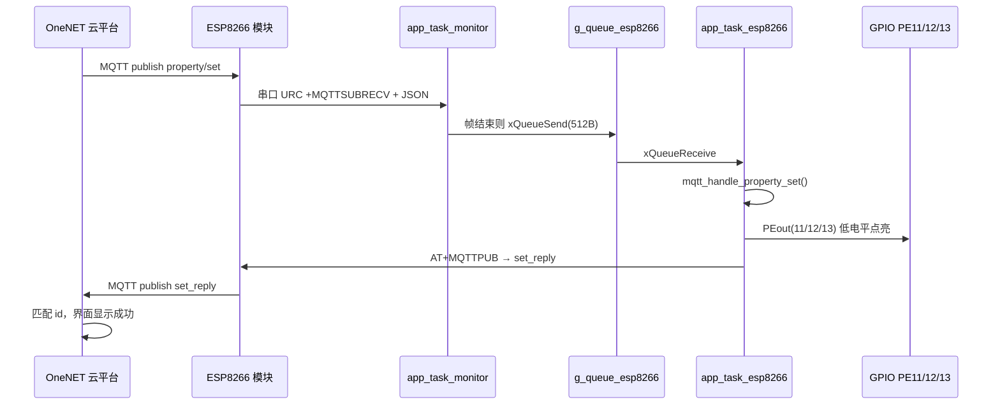

# OneNET 云端下行控灯与 set_reply 应答说明

> **适合谁读**：已在云平台能点「属性设置」、串口能看到 `+MQTTSUBRECV`，想搞懂「为什么以前报设备响应超时、现在灯能亮且平台也显示成功」的同学。  
> **配套代码**：`esp8266_mqtt.c` / `esp8266_mqtt.h`、`main.c` 中 `app_task_esp8266` / `app_task_monitor` / `app_task_mqtt`。  
> **延伸阅读**：[esp8266AT指令.md](./esp8266AT指令.md)（手工发 AT）、[ESP8266-OneNET-MQTT与FreeRTOS任务说明.md](./ESP8266-OneNET-MQTT与FreeRTOS任务说明.md)（三任务分工）。

---

## 1. 一分钟看懂：你在云平台点一次「开灯」

```text
你在 OneNET 控制台改 switch_led_1 = 1
        │
        ▼
云平台通过 MQTT 发到主题 …/thing/property/set
        │
        ▼
ESP8266 收到后，从串口吐出 +MQTTSUBRECV:…（里面带 JSON）
        │
        ▼
STM32 的 monitor 任务把这一帧放进队列
        │
        ▼
esp8266 任务解析 JSON → 改 PE11/12/13 → LED 亮/灭
        │
        ▼
STM32 再发 AT+MQTTPUB 到主题 …/thing/property/set_reply（带与下发相同的 id）
        │
        ▼
云平台在几秒内收到 set_reply → 界面显示「设置成功」，不再报 10411 超时
```

**重要结论（先记住）：**

- **灯会亮** 和 **平台不超时** 是两件相关但不完全相同的事。  
- 以前「半成功」：灯能亮，但平台仍超时 → 说明 **下行到了、GPIO 改了**，但 **set_reply 没发成功**。  
- 现在你日志里是 `set_reply id=16 OK` → **两件事都完成了**，所以是「完整成功」。

---

## 2. 三个 MQTT 主题（必背表）

以本工程产品 `y7l1o7W636`、设备 `test` 为例（宏在 `esp8266_mqtt.h`）：

| 方向 | 主题后缀 | 宏名 | 谁发 | 干什么 |
|------|----------|------|------|--------|
| 云 → 设备 | `thing/property/set` | `MQTT_SUBSCRIBE_TOPIC` | 平台 | 属性设置（控灯指令） |
| 设备 → 云 | `thing/property/set_reply` | `MQTT_SET_REPLY_TOPIC` | **STM32 必须发** | 告诉平台「我收到了，结果是 200」 |
| 云 → 设备 | `thing/property/post/reply` | `MQTT_REPLY_TOPIC` | 平台 | 对你周期上报的确认（调试用） |

完整主题形如：

```text
$sys/y7l1o7W636/test/thing/property/set
$sys/y7l1o7W636/test/thing/property/set_reply
$sys/y7l1o7W636/test/thing/property/post/reply
```

平台 **属性设置** 是 **同步流程**：发完 `set` 后会 **等** `set_reply`。等不到（一般约 6 秒内）就报：

> **属性设置失败：设备响应超时（错误码 10411）**

---

## 3. 从云端到 LED 的完整数据流



### 3.1 你这次成功的串口日志在说什么

```text
[app_task_esp8266] uart frame (151 bytes): +MQTTSUBRECV:0,".../thing/property/set",89,{"id":"16",...,"switch_led_1":0,...}

mqtt property/set: led1=0 led2=1 led3=0, set_reply id=16 OK
```

| 日志行 | 含义 |
|--------|------|
| `uart frame ... property/set` | 下行控灯帧 **完整进入应用层**（没被清缓冲、没被别的任务抢走） |
| `led1=0 led2=1 led3=0` | JSON 解析成功，三路 LED 目标值正确 |
| `set_reply id=16 OK` | 已向 `set_reply` 主题发出应答，且模块回了 `OK` / `+MQTTPUB:OK` |
| 后面 `post/reply` + `+MQTTPUB:OK` | 周期属性上报被平台确认，与控灯无关，说明 MQTT 链路仍健康 |

---

## 4. 工程里谁负责哪一步

| 步骤 | 位置 | 函数 / 任务 |
|------|------|-------------|
| 订阅 `property/set` | `esp8266_mqtt.c` | `esp8266_mqtt_init()` → `mqtt_subscribe_topic` |
| 串口收字节 | `usart.c` 中断 | 写入 `g_esp8266_rx_buf` |
| 判断一帧结束并入队 | `main.c` | `app_task_monitor` |
| 打印帧摘要、调处理函数 | `main.c` | `app_task_esp8266` |
| 识别 set / 解析 JSON / 控灯 | `esp8266_mqtt.c` | `mqtt_handle_property_set()` |
| 发 set_reply | `esp8266_mqtt.c` | `mqtt_publish_set_reply()` |
| JSON 转义（含逗号） | `esp8266_mqtt.c` | `mqtt_at_escape_payload()` |
| 周期上报温湿度与灯状态 | `main.c` + `esp8266_mqtt.c` | `app_task_mqtt` → `mqtt_report_devices_status()` |

---

## 5. 问题是怎么产生的（分阶段，便于对照自己踩过的坑）

### 阶段 A：最初只有订阅，没有 set_reply

- 工程只 **订阅** 了 `property/set`，没有向 **`property/set_reply`** **发布** 任何东西。  
- 即使后来用字节扫描把灯点亮了，平台也 **一定** 报 10411，因为它在等的那条 MQTT 消息根本不存在。

### 阶段 B：加了控灯和 set_reply，但 AT 发不出去（「半成功」）

现象（你当时的情况）：

- 串口能看到 `+MQTTSUBRECV:.../property/set`  
- `mqtt property/set: led1=1 ...` 且 **灯亮**  
- 但 `set_reply id=6 **FAIL**`，平台仍 **10411**

原因链条：

1. `set_reply` 的 JSON 很短，走 **`AT+MQTTPUB`**（第三段参数里塞整段 JSON）。  
2. ESP8266 的 AT 语法用 **英文逗号 `,` 分隔参数**，JSON 里也有逗号，例如：  
   `{"id":"6","code":200,"msg":"success"}`  
3. 若不对逗号做 **`\,` 转义**，模块会把 JSON 中间的逗号当成 **AT 参数结束符**，整行非法 → 回 **`ERROR`**。  
4. 失败后若再走 **`MQTTPUBRAW`**，此时串口里可能还有 `ERROR` 或 `+MQTTSUBRECV` 残留，容易 **误判失败**。  
5. **GPIO 在发 set_reply 之前就改了**，所以 **灯已经亮**，但 **平台等不到应答**。

这就是「半成功」：**执行了控制，没完成平台协议要求的应答。**

### 阶段 C：下行帧被清掉（灯也不听云端）

现象：

- 串口只有 `post/reply`，**没有** `property/set`  
- 或大量 `ERROR`、PUBRAW 失败

原因：

- `app_task_mqtt` 每秒 **周期上报** 也在发 AT，和 **收下行** 共用 `g_esp8266_rx_buf`。  
- 旧逻辑里 `ESP8266_SendCmdPolls` 等不到 `OK` 时会 **`ESP8266_Clear()`**，把正在缓冲里的 **`+MQTTSUBRECV(property/set)` 整段删掉**。  
- 没有互斥时，monitor 与 mqtt 任务还会 **抢同一块缓冲**。

### 阶段 D：改乱 PUBRAW / 心跳互斥后设备离线、上报失败

在排查过程中若：

- 每次 PUBRAW 都强制 Clear、或心跳与上报抢串口不当，  
会出现 **周期上报失败**、模块 **离线**，与控灯问题叠在一起，更难分辨。

当前 **稳定版本** 已回退到经过你验证的「半成功」逻辑，并保留 **逗号转义 + 专用 set_reply 发布**。

---

## 6. 问题是怎么解决的（五个关键点，缺一不可）

| # | 修复 | 解决什么问题 |
|---|------|--------------|
| 1 | 实现 `mqtt_publish_set_reply()`，发布到 `MQTT_SET_REPLY_TOPIC` | 平台能收到协议要求的应答，消除 10411 |
| 2 | **`mqtt_at_escape_payload` 对逗号转义为 `\,`** | `AT+MQTTPUB` 发 set_reply 不再 `ERROR`（**你问的这一点**） |
| 3 | set_reply **只走 AT+MQTTPUB**，失败也不轻易退回 PUBRAW | 短 JSON 路径简单、可预期 |
| 4 | `g_mutex_esp8266` + monitor 抢不到锁则不入队 | mqtt 发 AT 时下行不会被撕掉 |
| 5 | `ESP8266_SendCmdPolls` 未匹配 OK 时 **不 Clear**（保留 `+MQTTSUBRECV`）；PUBRAW 结束时有 URC 也不乱 Clear | 周期上报与下行共存 |

**对你问题的直接回答：**

> 是不是逗号转义成 `\,` 之后，云端就不报超时了？

**答：这是解决 10411 的「最后一环」，但不是唯一一环。**

- **没有 set_reply 主题发布** → 一定超时（与逗号无关）。  
- **有 set_reply 但 AT 因逗号 ERROR** → 灯可能亮，仍超时（半成功）。  
- **逗号转义正确 + set_reply 发出 OK** → 平台收到 `id` 匹配的应答 → **不再 10411**（你现在的 `set_reply id=16 OK`）。  
- 同时还需要 **下行不要被 Clear 掉**（互斥 + SendCmdPolls 策略），否则根本收不到 `property/set`，灯也不会按云端变。

---

## 7. 逗号转义详解（新手向）

### 7.1 ESP8266 如何理解一条 `AT+MQTTPUB`

示意（参数用逗号分开）：

```text
AT+MQTTPUB=0,"<主题>","<JSON字符串>",0,0
            ^      ^            ^
            参数1  参数2        参数3...
```

**参数 2 里如果再次出现未转义的 `,`，模块会认为参数 2 在这里就结束了**，后面内容变成乱参数 → **`ERROR`**。

### 7.2 set_reply 原始 JSON 与转义后（概念）

**原始 JSON（逻辑内容）：**

```json
{"id":"16","code":200,"msg":"success"}
```

**嵌入 AT 时，至少要做两类转义：**

- 双引号 `"` → `\"`（否则字符串边界错乱）  
- 逗号 `,` → `\,`（否则被当成 AT 参数分隔符）

代码里由 `mqtt_at_escape_payload()` 自动完成，再拼进：

```text
AT+MQTTPUB=0,"$sys/.../thing/property/set_reply","<转义后的整段>",0,0
```

你在 PC 上用串口助手手工测时，也要写成类似（与 [esp8266AT指令.md](./esp8266AT指令.md) 第 7 节一致）：

```text
AT+MQTTPUB=0,"$sys/y7l1o7W636/test/thing/property/set_reply","{\"id\":\"16\"\,\"code\":200\,\"msg\":\"success\"}",0,0
```

注意 `\"16\"\,` 里 **逗号前的反斜杠**：那就是 `\,` 转义。

### 7.3 为什么周期上报用 PUBRAW，set_reply 用 MQTTPUB

| 方式 | 典型用途 | 逗号问题 |
|------|----------|----------|
| `AT+MQTTPUB` | 短消息（如 set_reply） | JSON 在引号内，**必须** `\,` 转义 |
| `AT+MQTTPUBRAW` | 长 JSON（如整包属性上报） | 先发长度，再发**原始字节**，JSON 里的逗号 **不经过 AT 参数解析** |

`mqtt_report_devices_status()` 组的大 JSON 超过约 256 字节限制，走 **PUBRAW**；  
`set_reply` 很短，走 **MQTTPUB + 转义** 最合适。

---

## 8. `mqtt_handle_property_set` 处理顺序（与日志对应）

```text
收到 buf（含 +MQTTSUBRECV 与 JSON）
    │
    ├─ mqtt_frame_is_property_set() ？ 必须是 …/property/set（排除 set_reply、post/reply）
    │
    ├─ mqtt_frame_json_body() 定位 '{'
    │
    ├─ mqtt_parse_switch_value() 读 switch_led_1/2/3（支持 1 或 {"value":1}）
    │
    ├─ 写 PE11 / PE12 / PE13（低电平 = 亮）
    │
    ├─ mqtt_extract_set_request_id() 取出 "id":"16"
    │
    └─ mqtt_publish_set_reply("16")  → 日志 set_reply id=16 OK
```

**平台校验的是：下发 JSON 里的 `id` 与 set_reply 里的 `id` 一致。** 所以必须从下行里解析 `id`，不能写死成别的数。

---

## 9. 新手必读：`buf` 是什么？（`main.c` 约 2197 行）

### 9.1 一句话

**`buf` 是「ESP8266 从串口发来、被判定为收完整的一帧」的本地副本**，最多 512 字节，里面通常是 **AT 非请求上报（URC）** 的文本，而不是 STM32 自己组出来的 MQTT 包。

### 9.2 `buf` 从哪来（四步）

```text
① 云端 MQTT 下行
      ↓（在 ESP8266 模块内部完成，MCU 不跑 MQTT 协议栈）
② 模块把结果变成串口文本，例如：
   +MQTTSUBRECV:0,"$sys/.../thing/property/set",89,{...JSON...}
      ↓
③ USART3 中断 → 字节写入全局 g_esp8266_rx_buf，计数 g_esp8266_rx_cnt
      ↓
④ app_task_monitor：约 10ms 内字节数不变 → 认为一帧结束
      → xQueueSend 拷贝到队列 g_queue_esp8266
      ↓
⑤ app_task_esp8266：xQueueReceive(..., buf, ...)  →  你看到的 buf
```

所以：**`buf` = 队列里的一帧串口原文**，类型是 `uint8_t buf[512]`，末尾会补 `\0` 方便当字符串用 `strstr` 查找。

### 9.3 `buf` 里常见两种内容

| 内容类型 | 典型样子 | 会不会控灯 |
|----------|----------|------------|
| 属性设置下行 | 含 `thing/property/set` 和 `switch_led_x` | 会，交给 `mqtt_handle_property_set(buf)` |
| 上报确认 / 失败回显 | `post/reply` 或单独 `ERROR` | 不会控灯；纯 `ERROR` 在 2197 行被 `continue` 跳过 |

### 9.4 2197～2209 行在干什么（仍不改代码，只解释）

```c
/* 纯 ERROR 帧跳过；含 property/set 的混合帧仍需处理 */
if (strstr((char *)buf, "ERROR") != NULL &&
    strstr((char *)buf, "thing/property/set") == NULL)
    continue;
```

- 若这一帧 **只有** 模块回的 `ERROR`（某次 AT 失败），没有控灯主题 → **不打印、不解析**，避免刷屏。  
- 若一帧里 **既有 ERROR 又有 property/set**（少见）→ **仍处理**，避免误丢控灯指令。

后面 `preview` 只拷 **前 160 字符** 用于调试打印，完整数据仍在 `buf` 里传给 `mqtt_handle_property_set`。

---

## 10. 新手必读：控灯那几行在干什么？（`esp8266_mqtt.c` 约 810～820 行）

### 10.1 先纠正一个常见误解

**不是**「STM32 把 MQTT 协议转换成 JSON」。

更准确的说法是：

| 层级 | 谁在做 | MCU 要不要自己写 MQTT |
|------|--------|------------------------|
| MQTT | ESP8266 固件 + 云端 Broker | **不要**，模块已连好并订阅 |
| 串口 AT 文本 | 模块收到 MQTT 后，用 `+MQTTSUBRECV:...` **把载荷以文本形式吐给 MCU** | MCU 只读字符串 |
| JSON | 载荷 **本来就是** OneNET 规定的 JSON 文本 | MCU **解析这段文本** |
| GPIO | `PEout(11/12/13)` | MCU 根据 0/1 驱动引脚 |

也就是说：**MQTT 在模块里已经解完了**；MCU 看到的是 **「AT 行 + 里面的 JSON 字符串」**，再从中抠出 `switch_led_1` 是 0 还是 1。

### 10.2 云端 JSON 长什么样

控制台属性设置时，平台下发的 JSON 类似（你日志里的真实例子）：

```json
{"id":"16","version":"1.0","params":{"switch_led_1":0,"switch_led_2":1,"switch_led_3":0}}
```

- `1` → 开灯（逻辑上）  
- `0` → 关灯（逻辑上）  
- `id` → 后面 `set_reply` 必须原样带回

### 10.3 三行 `mqtt_parse_switch_value` 在做什么

```c
v1 = mqtt_parse_switch_value(json, "switch_led_1");
v2 = mqtt_parse_switch_value(json, "switch_led_2");
v3 = mqtt_parse_switch_value(json, "switch_led_3");
```

在 JSON 字符串里 **查找关键字** `switch_led_1` 等，看冒号后面是 `0` 还是 `1`（也支持 `"switch_led_1":{"value":1}` 这种物模型写法）。

返回值含义：

| 返回值 | 含义 |
|--------|------|
| `1` | 云端要求该路灯 **开** |
| `0` | 云端要求该路灯 **关** |
| `-1` | 这一帧里没有这个键，**不要改** 对应 GPIO |

### 10.4 三行 `PEout` 与三元运算符（核心语法）

```c
if (v1 >= 0)
    PEout(11) = (v1 != 0) ? 0 : 1;
```

拆开读：

1. **`if (v1 >= 0)`**  
   只有解析成功才改引脚；若 `v1 == -1`（本帧没下发 led1），**保持原状**。

2. **`(v1 != 0) ? 0 : 1`**（三元运算符）  
   - 若 `v1` 是 1（开）→ 表达式结果是 **0**  
   - 若 `v1` 是 0（关）→ 表达式结果是 **1**  

3. **为什么「开」要写 0？**  
   本硬件 **低电平点亮**：`PEout(11)=0` 时 LED 亮，`PEout(11)=1` 时灭。  
   云端说的「1=开」和引脚电平相反，所以用三元运算 **翻一次**。

对照表（以 `switch_led_1` → PE11 为例）：

| 云端 JSON | `v1` | `PEout(11)` | LED |
|-----------|------|-------------|-----|
| `"switch_led_1":1` | 1 | 0 | 亮 |
| `"switch_led_1":0` | 0 | 1 | 灭 |

`PEout(12)`、`PEout(13)` 同理，对应第二、三路灯。

### 10.5 和 `buf` 的关系（串起来）

```text
buf（整帧串口文本，含 +MQTTSUBRECV 头）
  → mqtt_handle_property_set(buf)
      → 从中找到 '{' 起的 json 段
      → mqtt_parse_switch_value 得到 v1,v2,v3
      → PEout 写 GPIO
      → mqtt_publish_set_reply 用 json 里的 id 回云平台
```

---

## 11. 串口日志速查

| 现象 | 可能原因 |
|------|----------|
| 只有 `post/reply`，没有 `property/set` | 下行被 Clear；或云端未真正下发；或订阅失败 |
| 有 `property/set`，灯不变 | JSON 里没有 `switch_led_x`；GPIO 引脚不对（本工程为 PE11/12/13） |
| 有 `property/set`，灯变，但 `set_reply … FAIL` | 逗号/引号未转义；或发 AT 时缓冲被干扰 |
| `set_reply … OK` 但平台仍失败 | 产品/设备名主题不一致；id 不一致；网络延迟极大（少见） |
| 大量 `MQTT Publish Failed (PUBRAW …)` | 周期上报路径问题；与控灯 set_reply 是不同路径 |
| 纯 `ERROR` 九字节帧 | 多为某次 AT 失败回显，工程里已过滤刷屏 |

---

## 12. 与「完整成功」对照的检查清单

烧录后可在 **设备调试 → 属性设置** 自测：

- [ ] 串口出现 `thing/property/set` 的 `uart frame`  
- [ ] `mqtt property/set: led1=… led2=… led3=…`  
- [ ] **`set_reply id=… OK`**（不是 FAIL）  
- [ ] 实物 LED 与设置一致  
- [ ] 云平台 **不再** 报 10411，显示设置成功  

---

## 13. 相关文档索引

| 文档 | 内容 |
|------|------|
| [ESP8266-MQTT属性上报与mqtt_publish_data说明.md](./ESP8266-MQTT属性上报与mqtt_publish_data说明.md) | **上行**：`mqtt_publish_data`、`topic`、`n`/`snprintf`、1200 与 230 字节 |
| [esp8266AT指令.md](./esp8266AT指令.md) | 不用 MCU，只用 USB-TTL 手工发 AT、练 `\,` 与 PUBRAW |
| [ESP8266-OneNET-MQTT与FreeRTOS任务说明.md](./ESP8266-OneNET-MQTT与FreeRTOS任务说明.md) | mqtt / esp8266 / monitor 三任务与队列 |
| [FreeRTOS调试打印与ESP8266联调问题总结.md](./FreeRTOS调试打印与ESP8266联调问题总结.md) | 互斥量、调试串口、RX 被清空等联调坑 |

**阅读分工**：本文档侧重 **云 → 设备**（`property/set` / `set_reply`）；周期 **设备 → 云** 上报见上一行新文档。

---

*文档版本：与 2026 年联调通过的「set_reply OK + 控灯正常」固件行为一致；第 9、10 节对应 `main.c` 的 `buf` 与 `esp8266_mqtt.c` 的 JSON/GPIO 解析。若改发布或入队逻辑，请同步更新。*
